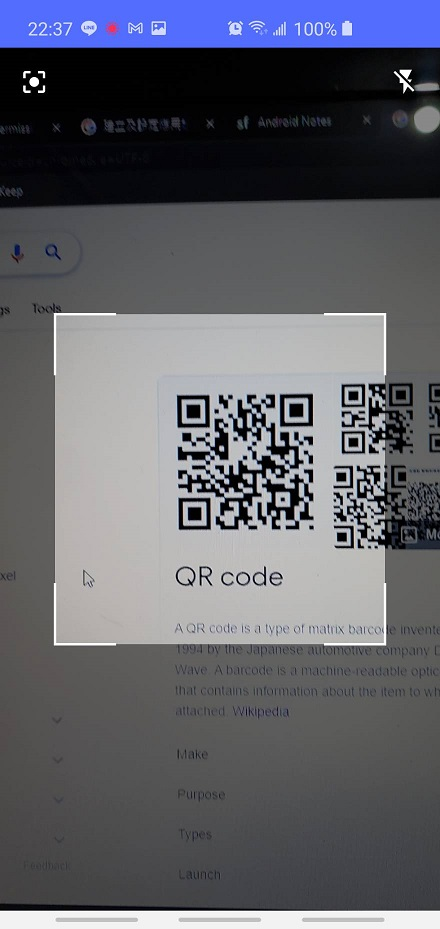

# 台灣實聯制 QR Code 掃描器
簡易台灣實聯制QR Code掃描器，具備以下功能：
1. 掃描實聯制 QR Code
2. 阻擋非實聯制QR Code
3. 自動轉跳簡訊頁面
4. 提醒使用者安裝、啟用「台灣社交距離APP」

Playstore 連結：審核中
QR Code Library: [Link](https://github.com/yuriy-budiyev/code-scanner)

# Taiwan CDC QR Code Scanner
Simple Taiwan CDC QR Code Scanner for the Android, which contains the following features:

1. Scan the CDC location QR code
2. Block the non CDC location QR code
3. Automatically redirect to the SMS sending page
4. Notify the user to install/enable the "Taiwan Social Distancing APP"

Playstore like: Under review

QR Code Library: [Link](https://github.com/yuriy-budiyev/code-scanner)

